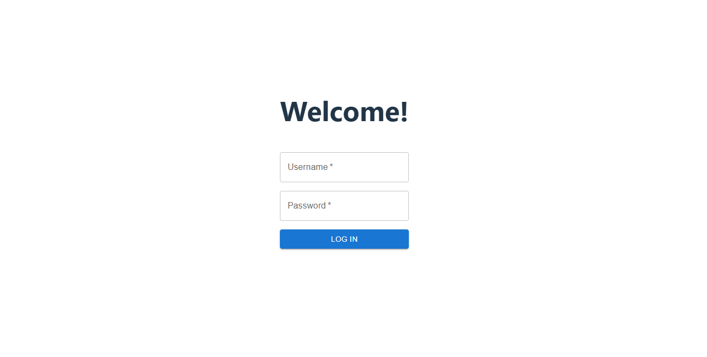
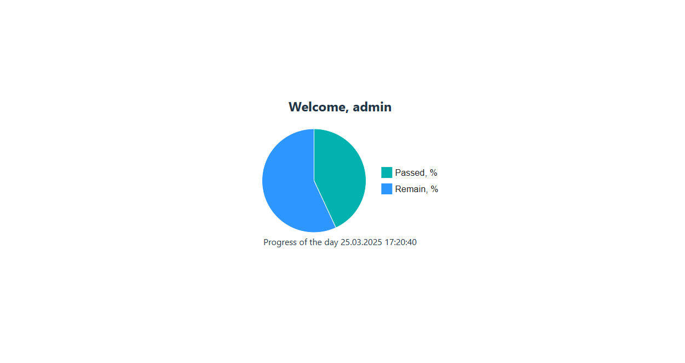

# Приложение для отображения круговой диаграммы с аутентификацией

Серверная часть (Python, FastAPI): генерирует данные для круговой диаграммы в формате JSON и реализует механизм аутентификации с использованием JWT токенов.

Клиентская часть (React + Redux + Material UI): после получения jwt токена обращается к API для получения данных и отрисовывает pie chart на основе этих данных.

Gateway: в качестве web-сервера используется NGINX. Приложение доступно на 80 порту. 

# Конфигурирование

Необходимо настроить конфигурации backend и frontedn в .env-файлах. Примеры конфигураций предоставлены в .sample-файлах.

```bash
# backend/.env

SECRET_KEY = "08a710ba213bd22e0fc60ad572fcf78a5778e2a523ec8d22e9c5ca955929c7f8"
ALGORITHM = HS256
ACCESS_TOKEN_EXPIRE_MINUTES = 30
```

```bash
frontend/.env

VITE_API_BASE_URL=http://localhost/api
VITE_API_VERSION=v1
```

# Развертывание

Для удобства развертывания предоставлен `docker-compose.yml`

```bash
docker compose up --build
```

# Запуск и использование

Перейдите по адресу http://localhost

Тестовый аккаунт: 
```
username: admin
password: admin
```



